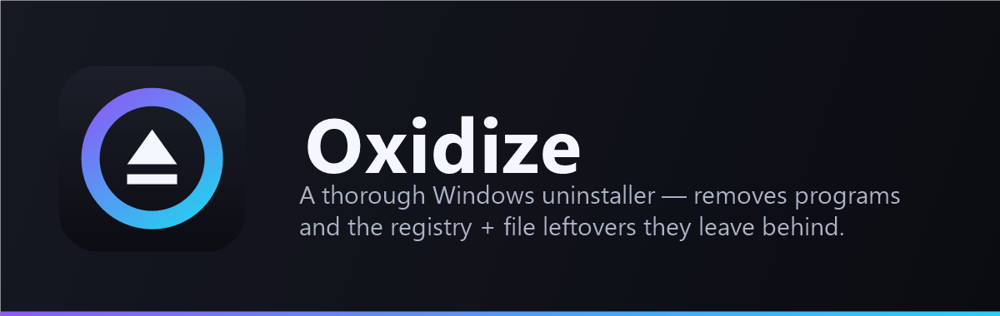

<div align="center">



[](https://github.com/dominikkoenitzer/Oxidize/actions/workflows/ci.yml)


</div>

A thorough Windows uninstaller, written in Rust.

Windows' built-in uninstaller frequently leaves junk behind — orphaned registry
keys, leftover files, and empty folders under `AppData`, `ProgramData`, and
`Program Files`. **Oxidize** runs a program's *own* uninstaller and then scans
for and removes what it left behind, always backing up first.

> ⚠️ **This tool deletes registry keys and files.** Test it in a throwaway VM.
> Every destructive action supports `--dry-run`, backs up registry keys to a
> `.reg` file, and quarantines deleted files so they can be restored — but treat
> it with the same caution you would any cleanup tool.

---

## Features

| Capability | Command | Notes |
|---|---|---|
| **List installed programs** | `oxidize-cli list` | Reads HKLM (64-bit), HKLM\WOW6432Node (32-bit) and HKCU uninstall keys. Name, version, publisher, size, install date, source. System components filtered out (`--all` to include). |
| **Standard uninstall** | `oxidize-cli uninstall <name>` | Runs the program's registered `UninstallString` (or a synchronous `msiexec /x{GUID}` for MSI products), then verifies removal. |
| **Leftover scan** | `oxidize-cli scan <name>` | Finds orphaned registry keys/values and leftover files/folders, grouped registry-vs-filesystem, each with a confidence level. |
| **Safety / backup** | `--dry-run`, automatic `.reg` backup + file quarantine, elevation detection | Nothing is destroyed without a verified backup. |
| **Hunter mode** | `oxidize-cli hunter <exe-path \| process-name>` | Traces a running process or an executable/folder back to its installed program. |

Out of scope (deliberately): junk/temp cleaners, browser-trace cleaning, startup
manager, Windows tools shortcuts.

---

## Two front-ends, one engine

Oxidize ships as **two binaries** that share the same engine (`src/lib.rs`):

* **`oxidize-cli.exe`** — the command-line interface (scriptable, JSON output).
* **`oxidize-gui.exe`** — a native desktop window (egui), if you'd rather click.

## Building

Requires the Rust toolchain (stable) on Windows with the MSVC build tools.

```powershell
cargo build --release
# CLI:  target\release\oxidize-cli.exe
# GUI:  target\release\oxidize-gui.exe
```

Run the GUI:

```powershell
.\target\release\oxidize-gui.exe
```

Run the tests and linter:

```powershell
cargo test
cargo clippy --all-targets
```

### The GUI

The window has a searchable program list on the left and, for the selected
program, its details plus **Run uninstaller** / **Scan for leftovers** buttons.
Scan results show registry and filesystem leftovers with per-item checkboxes and
colour-coded confidence (HIGH/MED/LOW); the HIGH items are checked by default.
The toolbar mirrors the CLI flags — **Dry run**, **Create backups**, **Silent
uninstall**, **Show system components** — and shows whether you're elevated
(with a *Restart as admin* button). Destructive actions ask for confirmation,
back up to `.reg` + quarantine first, and run on a background thread so the
window never freezes.

---

## Usage

```text
oxidize-cli <COMMAND> [OPTIONS]

Commands:
  list       List installed programs (read-only)
  uninstall  Run a program's uninstaller, then optionally scan/remove leftovers
  scan       Scan for a program's leftovers, and optionally remove them
  hunter     Trace a running process / executable back to its installed program

Global options:
  --dry-run         Show what would happen without changing anything
  -y, --yes         Assume "yes" to all confirmation prompts
  --json            Emit machine-readable JSON
  --no-color        Disable coloured output
  --no-backup       Do NOT back up before deleting (dangerous)
  --elevate         Relaunch with Administrator rights (UAC prompt)
  -v, --verbose     Increase verbosity
```

### Examples

```powershell
# Browse what's installed, biggest first
oxidize-cli list --sort size

# Find a specific publisher's apps
oxidize-cli list intel

# See what an uninstall + cleanup WOULD do, touching nothing
oxidize-cli --dry-run uninstall "Some App" --scan --remove

# The full flow: uninstall, then find and remove leftovers
oxidize-cli uninstall "Some App" --remove

# Just scan for leftovers (e.g. after a manual uninstall) and review them
oxidize-cli scan "Some App"

# Scan and also act on medium-confidence items
oxidize-cli scan "Some App" --remove --include-medium

# Trace a process back to its program and uninstall it
oxidize-cli hunter "C:\Program Files\Some App\app.exe" --uninstall --remove
```

### A note on confidence levels

The scanner labels each leftover:

* **HIGH** — strong evidence it belongs to the program (inside the install
  folder, the program's own orphaned uninstall key, an exact name match, an
  App Paths entry for its executable). Removed by default.
* **MED** — plausible, but could belong to a sibling product or be a partial
  match. Only removed with `--include-medium`.
* **LOW** — weak signal, shown for context; only removed with `--include-all`.

Publisher folders/keys that may hold *several* products (e.g.
`Program Files\Some Vendor`) are **descended into** to find the specific
product, never deleted wholesale. OS and shared locations (`C:\Windows`,
`SOFTWARE\Microsoft`, driver-vendor roots, …) are excluded entirely.

---

## Safety model

Oxidize layers its safety:

1. **Dry-run** (`--dry-run`) prints every action and changes nothing.
2. **Registry backup** — before any key/value is deleted, the key is exported to
   a `.reg` file using Windows' own `reg.exe export`, and the file is validated
   (UTF-16 BOM + `Windows Registry Editor Version 5.00` header) before the delete
   is allowed. Restore with `reg import <file>.reg` (or double-click it).
3. **File quarantine** — files and folders are *moved* into the backup directory
   (preserving their original path) rather than destroyed, so you can move them
   back. Use `--no-backup` to delete permanently (not recommended).
4. **Confirmation** — interactive prompts before destructive steps (skip with
   `-y`).
5. **Elevation detection** — Oxidize checks whether it is running as
   Administrator and warns you, since HKLM and `Program Files` changes require
   it. `--elevate` relaunches via a UAC prompt.

Backups live under:

```
%LOCALAPPDATA%\Oxidize\backups\<timestamp>_<program>\
    registry\   *.reg exports
    files\      quarantined files/folders (original path preserved)
```

---

## Architecture

A single-binary CLI. Modules:

| Module | Responsibility |
|---|---|
| `model` | Shared, dependency-free data types (`Program`, `Leftover`, `ScanReport`, …). |
| `util` | Pure helpers: Windows command-line splitting, `%VAR%` expansion, name tokenisation, formatting. Unit-tested. |
| `registry` | Enumerate installed programs; read/exists/delete registry primitives (64-bit physical-path addressing, WOW64-aware). |
| `uninstall` | Build and run a program's registered uninstaller; verify completion. |
| `scanner` | The leftover scanner — registry + filesystem, with the matching/confidence logic and safety denylists. |
| `backup` | `.reg` export (validated) and file quarantine. |
| `safety` | Elevation detection/relaunch and the single destructive choke point. |
| `hunter` | Map a process/exe/folder back to an installed program. |
| `cli` / `commands` | clap definitions and orchestration/rendering. |
| `term` | Colour, VT enabling, prompts. |

### Key Windows details handled

* **Registry views** — 64-bit installers register under `SOFTWARE\...`, 32-bit
  under `SOFTWARE\WOW6432Node\...`. Oxidize reads both (plus HKCU) and always
  addresses keys by their physical path with `KEY_WOW64_64KEY`.
* **MSI vs EXE uninstallers** — MSI products are uninstalled with a synchronous
  `msiexec /x{GUID}` (reliable exit code); EXE uninstallers use
  `QuietUninstallString`/`UninstallString`, parsed with the real
  `CommandLineToArgvW` rules. Because some EXE uninstallers relaunch a copy from
  `%TEMP%` and exit early, completion is confirmed by re-checking the registry.
* **Elevation** — via the `TOKEN_ELEVATION` token-information class, not a fragile
  write-probe.

---

## Status / roadmap

All planned milestones are implemented:

1. ✅ Read-only installed-programs lister
2. ✅ Standard uninstall invocation
3. ✅ Leftover scanner (registry + filesystem, incl. autostart entries)
4. ✅ Safety layer (dry-run, `.reg` backup, file quarantine, elevation)
5. ✅ Hunter mode

Possible future work: a `restore` subcommand that re-imports a backup directory,
reading the file version-info (CompanyName) to strengthen hunter matching, and a
deeper "Advanced" scan mode that walks more registry surface.

---

<div align="center">
<sub>Built in Rust 🦀 · <code>oxidize-cli</code> + <code>oxidize-gui</code></sub>
</div>
